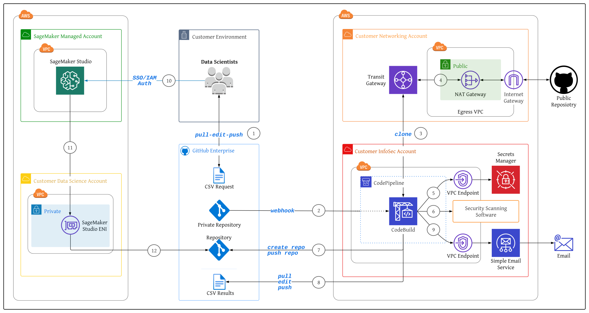
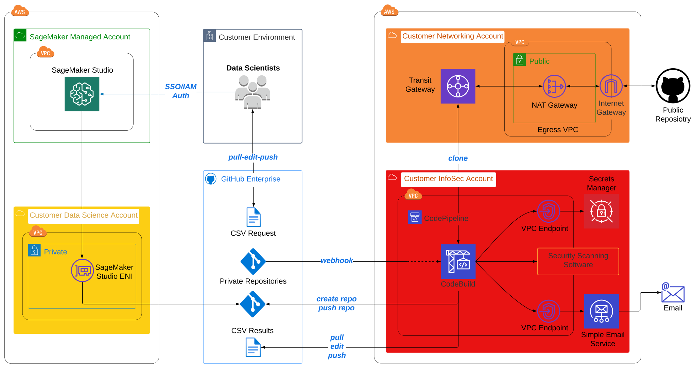

# Securing Access to External Package Repositories Using AWS CodeSuite Automation
---
The goal of this solution is to demonstrate the deployment of AWS CodeSuite Services (i.e., CodeBuild, CodePipeline) to orchestrate secure MLOps access to external package repositories in a data science environment configured with multi-layer security.

This GitHub repository is intended to accomany the blog post, [Securing Access to External Package Repositories Using AWS CodeSuite Automation](https://aws.amazon.com/blogs/).

This solution covers two main topics:
1. Self-service data scientist workflow for accessing external package repositoires.
2. Automated orchestration of external repo security scanning for InfoSec compliance.

## Content
- [Solution Architecture](#solution-architecture)
- [Multi-Account Configuration](#multi-account-configuration)
- [Deployment Guide](#deployment)
- [Testing & Validation](#testing-and-validation)
- [Clean Up](#clean-up)

## Solution Architecture
This section describes the overall solution architecture.

### Overview

**1 – Data Scientist Self-Service Model**  
The data scientist pulls the current version of the public repository request CSV file from the private GitHub repository, appends desired additional public repositories to the request record, then pushes the updated request file back to the private repository.

**2, 3 – External Repository Ingest**  
AWS CodePipeline execution is triggered based on the latest request file check-in. CodePipeline orchestrates one build and one test stage via AWS CodeBuild. During the build stage, CodeBuild parses the request file, identifies the new public repository to ingest, then executes git clone on the remote repository. Centralized internet egress is facilitated from through the Customer Networking Account, which the Customer InfoSec Account is connected to through a Transit Gateway (TGW) Attachment.

**4 – Infrastructure Security**  
Centralized internet egress occurs through a NAT Gateway (NGW) attached to the egress VPC in the Customer Networking Account, reducing the cost associated with a distributed model where NGWs are deployed in every spoke VPC. The Elastic IP (EIP) of the NAT Gateway provides customers with a single IP address that they can include in their allow-list for ingress into other external networks. 

**5, 6, 7, 8, 9 – Automated Security Scanning and Results Notification**  
CodeBuild gathers required secrets from Secrets Manager to execute security scanning software and manage GitHub artifacts in subsequent test stages. During the test stage, CodeBuild performs agent-based static application security testing, software composition analysis, dynamic code analysis, and image vulnerability scans.  The test stage output is analyzed as part of the CodePipeline orchestration. If the security scans return lower than medium severities, CodeBuild creates a new private repository in the customer-managed GitHub organization, then executes git push of the external package to the internal repository.
CodeBuild then performs a git pull of the current results CSV file, updates the file with the outcome of the latest request, then executes a git push of the updated results file to the private repository. A CodeBuild notification rule then uses Amazon Simple Email Service (SES) to email the results, positive or negative, to the requesting data scientist.

**10, 11, 12 – MLOps Workflow**  
The data scientist authenticates to their SageMaker Studio domain via AWS Identity Center or Identity and Access Management (IAM) mode. Each auth-mode maps to the user profile’s associated execution role that define the user’s permissible notebook actions. SageMaker Studio runs on an environment managed by AWS. Studio provides an elastic network interface (ENI) that can be deployed into a customer-managed VPC for more granular control of notebook traffic.
The data scientist executes their SageMaker Studio notebook which installs the InfoSec validated external packages using the newly-created private repository endpoint (e.g., https://github.com/customer-org/new-repo.git).

## Multi-Account Configuration
The following diagram highlights a multi-account structure where functional teams are isolated by the security, access, and billing boundaries of their AWS account:

This is a proposed multi-account structure that can be adapted for your specific requirements, organizational and governance structure, and project methodology.

The AWS Whitepaper for [Building a Secure Enterprise Machine Learning Platform](https://docs.aws.amazon.com/whitepapers/latest/build-secure-enterprise-ml-platform/aws-accounts.html) recommends production data science environments use multiple AWS accounts for the following benefits:
- Group workloads based on business purpose and ownership
- Apply distinct security controls by environment
- Limit scope of impact from adverse events
- Improve cost visibility and control
- Constrain access to sensitive data

The solution follows the multi-account approach by deploying separate CloudFormation stacks into each respective account:
- **Customer Data Science Account:** Contains separate Amazon SageMaker Studio domains per data science team. This account is used by data scientists and ML engineers to perform experimentation and development.
- **Customer Networking Account:** Isolates the networking services, configuration, and operation from the individual application workloads, security, and other infrastructure. 
- **Customer InfoSec Account:** Dedicated to operating security services, monitoring AWS accounts, and automating security alerting and response.

The above multi-account structure can be expanded upon for further sub-division. Each of these account groups can have multiple AWS accounts and environments for development and testing of services and storing different data classifications: 

❗ For production environments, we recommend the use of two additional account groups:
- **Shared Services:** accounts: Hosts common resources like team code repositories, CI/CD pipelines for MLOps workflows, Docker image repositories, Service Catalog portfolios, and model registries. 
- **Data Management:** accounts: Stores and manages all data for the machine learning process with strong data security and governance practices using [AWS Data Lake](https://aws.amazon.com/solutions/implementations/data-lake-solution/) and [AWS Lake Formation](https://aws.amazon.com/lake-formation/).

## Deployment
see [Deployment Guide](documentation/deployment-guide.md)

## Testing & Validation
see [Testing & Validation](documentation/testing-and-validation.md)

## Clean Up
see [Clean Up](documentation/clean-up.md)

---

Copyright Amazon.com, Inc. or its affiliates. All Rights Reserved.
SPDX-License-Identifier: MIT-0
