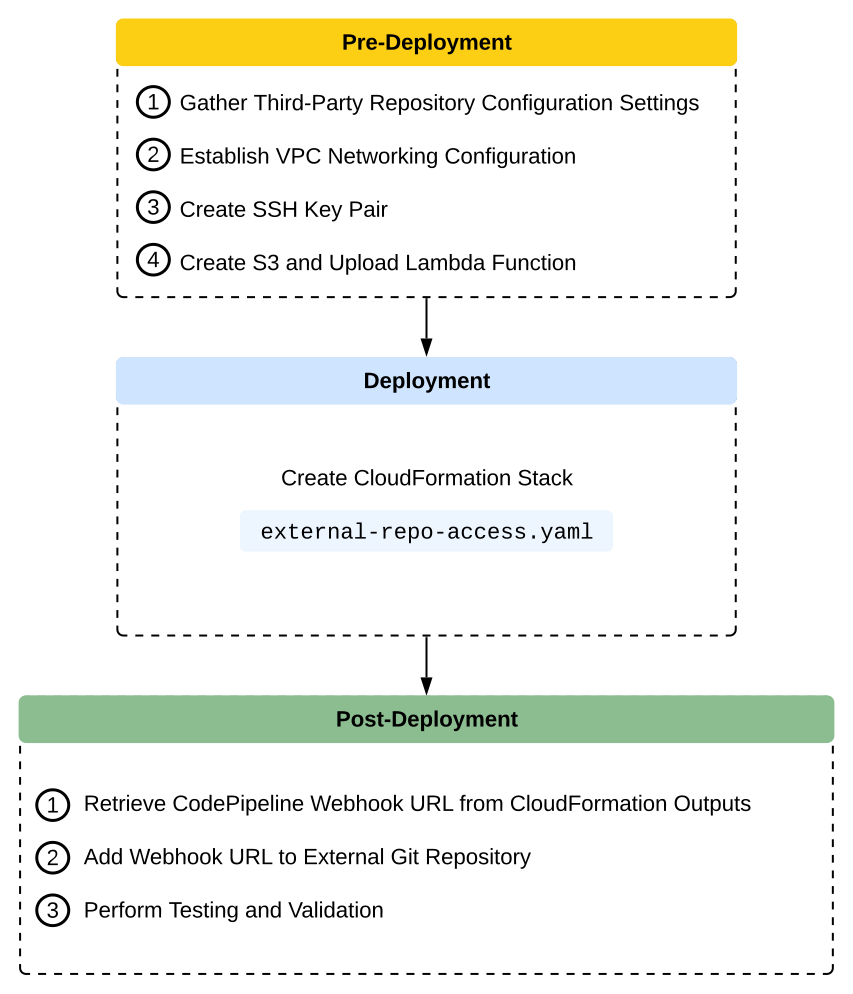
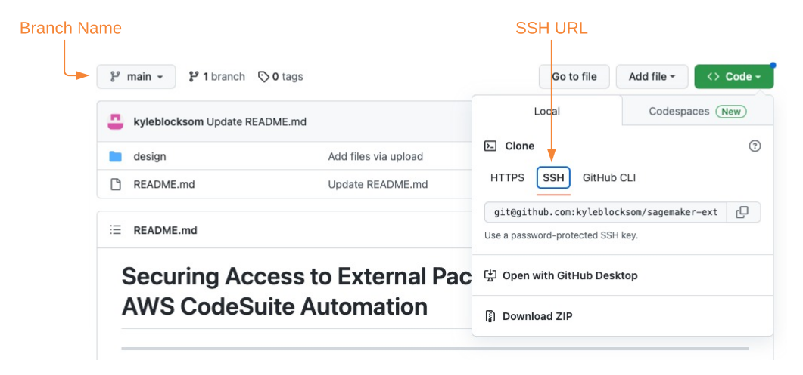

# Deployment Guide
---
## Deployment Workflow
The below workflow diagram visualizes the end-to-end deployment process that is detailed within this guide. The resultant architecture includes an AWS CodePipeline worfklow orchestration that triggers based on a SSH-secured webhook with your internal Git repository. The worfklow consists of an AWS CodeBuild project to clone remote package repositories so that an additional CodeBuild project can be used to complete static application security testing, software composition analysis, dynamic code analysis, and image vulnerability scanning.



## Pre-Deployment
By default, AWS CloudFormation uses a temporary session that it generates from your user credentials for stack operations. If you specify a service role, CloudFormation will instead use that role's credentials.

To deploy this solution, your IAM user/role or service role must have permissions to deploy the resources specified in the CloudFormation template. For more details on AWS Identity and Access Management (IAM) with CloudFormation, please refer to the [AWS CloudFormation User Guide](https://docs.aws.amazon.com/AWSCloudFormation/latest/UserGuide/using-iam-template.html).

You must also have [AWS CLI](https://aws.amazon.com/cli/) installed. For instructions on installing AWS CLI, please see [Installing, updating, and uninstalling the AWS CLI](https://docs.aws.amazon.com/cli/latest/userguide/cli-chap-install.html). If you would like to use the multi-account model deployment option, you need access to minimum two AWS accounts, recommended three accounts for development, staging and production environments.

### Gather Third-Party Repository Configuration Settings
The CloudFormation template requires a total of eleven user-defined parameters, 2 of which are specific to the third-party repository that you wish to clone.

Navigate to the third-party repository and note the branch name and SSH URL:



### Establish VPC Networking Configuration
This solution requires private VPC subnets into which you can deploy your Lambda Function and CodeBuild Project. These private subnets must be deployed into a VPC that is also configured with a NAT Gateway (NGW) in a public subnet to facilitate intenret ingress and egress through an Internet Gateway.

If your environment does not have the required VPC, subnets, NAT Gateway, and Internet Gateway configuration, you can create those by launching the following [CloudFormation template](https://github.com/awsdocs/aws-lambda-developer-guide/blob/master/templates/vpc-privatepublic.yaml).

### Create SSH Key Pair
To authenticate with the third-party Git repository, you will use an SSH key pair. To create the key pair, use the below ssh-keygen command in your local terminal:

```sh
ssh-keygen -t rsa -b 4096 -C "your_git_email@example.com"
```

Follow the commands prompts to create a filename (ex: external-repo-rsa) and optional paraphrase for the key. This generates your private/public rsa key pair in the current directory: external-repo-rsa and external-repo-rsa.pub.

Make a note of the contents of external-repo-rsa.pub and add it as an authorized key for your Git user. For instructions, please see [Adding an SSH key to your GitLab account](https://docs.gitlab.com/ee/ssh/#adding-an-ssh-key-to-your-gitlab-account).

Next, publish your private key to AWS Secrets Manager using the AWS Command Line Interface (AWS CLI):

```sh
SECRETS_MANAGER_SSH_ARN=$(aws secretsmanager create-secret --name external-repo-rsa \
--secret-string file://external-repo-rsa --query ARN --output text)
```
Make a note of the Secret ARN, which you will input later as the _SecretsManagerArnForSSHPrivateKey_ CloudFormation parameter.

### Create S3 and Upload Lambda Function
This solution leverages a Lambda function that polls for the job details of the CodePipeline custom source action. Once there is a change on the source branch, the Lambda function triggers AWS CodeBuild execution and passes all the job-related information.
Once CodeBuild complete its execution, the Lambda function then sends a success message to the CodePipeline source stage so it can proceed to the next stage.

The Lambda function code needs to be uploaded to an S3 bucket in the same region where the CloudFormation stack is being deployed. To create a new S3 bucket, use the following AWS CLI commands:

```sh
ACCOUNT_ID=$(aws sts get-caller-identity --query Account --output text)
S3_BUCKET_NAME=repo-clone-lambda-${ACCOUNT_ID} 
aws s3 mb s3://${S3_BUCKET_NAME} --region us-east-1
```
Clone the _sagemaker-external-repo-access Repository_ and navigate to the Lambda folder for the compressesed [Lambda code file](../lambda/repo-clone-lambda.zip), then upload the file to the S3 bucket you just created using the following commands:

```sh
git clone https://github.com/kyleblocksom/sagemaker-external-repo-access.git
cd sagemaker-external-repo-access/lambda/
aws s3 cp repo-clone-lambda.zip s3://${S3_BUCKET_NAME}/repo-clone-lambda.zip
```

#### Optional - Run Security Scan on the CloudFormation Templates
If you would like to run a security scan on the CloudFormation templates using [`cfn_nag`](https://github.com/stelligent/cfn_nag) (recommended), you have to install `cfn_nag`:
```sh
brew install ruby brew-gem
brew gem install cfn-nag
```

To initiate the security scan, run the following command:
```sh
cd ../cfn/
cfn_nag_scan --input-path ./external-repo-access.yaml
```

## Deployment 
The following section provides instructions for deploying the paramterized [external-repo-access.yaml](../cfn/external-repo-access.yaml) CloudFormation template into your AWS account. You can also deploy the solution using the [create-stack.sh](../shell/create-stack.sh) shell script. 

❗ Both deployment options require that you specify valid CloudFormation paramaters for your prerequisite AWS resources (e.g., VPC, subntes, S3 bucket) and GitHub environment settings (e.g., Branch, GitURL) to be used for stack deployment. Set the corresponding CloudFormation parameters to names, values, and resource IDs of your existing resources.

The stack (`external-repo-access.yaml`) provisions the following primary resources:
1. CodePipeline Pipeline to orchestrate solution workflow.
2. CodePipeline Artifact Bucket for storing stages' compressed input and output artifacts.
3. CodePipeline Custom Action Type to invoke CodePipeline and Git webhook on user commits to Git repo. Custom Source Action triggers CloudWatch Events rule to trigger Lambda execution of CodeBuild Project.
4. Lambda function and execution role to trigger CodeBuild Project.
5. KMS key to store SSH keys.
6. CodeBuild Project and service role to retrieve SSH key from Secrets Manager to clone, compress, then upload external repo branch to CodePipeline Artifact Bucket.

CloudFormation prepopulates stack parameters with the default values provided in the template. To provide alternative input values, you can specify parameters via `ParameterKey=<ParameterKey>,ParameterValue=<Value>` pairs in the `aws cloudformation create-stack` call. The following series of commands clones the _sagemaker-external-repo-access_ repository to your local machine so you can then create the stack using AWS CLI commands:

```sh
# If not already cloned, clone remote repository and change working directory to CloudFormation folder
git clone https://github.com/kyleblocksom/sagemaker-external-repo-access.git
cd sagemaker-external-repo-access/

# Use defaults or provide your own parameter values
STACK_NAME="external-repo-access"
CODEPIPELINE_NAME="external-repo-pipeline"
SOURCE_PROVIDER='CustomGitSource'
SOURCE_VERSION='1'

# Below parameter values acquired from 'Gather Third-Party Repository Configuration Settings' pre-deployment section
GIT_BRANCH=<remote repo branch name>
GIT_URL=<remote repo Git URL>
GIT_WEBHOOK_IP=<webhook IP used by remote repo> #https://api.github.com/meta

# Below parameter values acquired from 'Establish VPC Networking Configuration' pre-deployment section
VPC_ID=<vpc with NGW and IGW>
SUBNET_ID1=<private subnet 1 from above VPC>
SUBNET_ID2=<private subnet 2 from above VPC>

# Below parameter values acquired from 'Create SSH Key Pair' pre-deployment section
SECRETS_MANAGER_SSH_ARN=<ARN of SSH Secret>

# Below parameter values acquired from 'Create S3 and Upload Lambda Function' pre-deployment section
LAMBDA_S3_BUCKET=<S3 bucket with compressed Lambda code>
LAMBDA_S3_KEY=<S3 key of compressed Lambda code>

aws cloudformation create-stack \
--stack-name ${STACK_NAME} \
--template-body file://$(pwd)/cfn/external-repo-access.yaml \
--parameters ParameterKey=SourceActionVersion,ParameterValue=${SOURCE_VERSION} \
ParameterKey=SourceActionProvider,ParameterValue=${CustomSourceForGit} \
ParameterKey=GitBranch,ParameterValue=${GIT_BRANCH} \
ParameterKey=GitUrl,ParameterValue=${GIT_URL} \
ParameterKey=GitWebHookIpAddress,ParameterValue=${GIT_WEBHOOK_IP} \
ParameterKey=SecretsManagerArnForSSHPrivateKey,ParameterValue=${SECRETS_MANAGER_SSH_ARN} \
ParameterKey=RepoCloneLambdaSubnet,ParameterValue=${SUBNET_ID1}\\,${SUBNET_ID2} \
ParameterKey=RepoCloneLambdaVpc,ParameterValue=${VPC_ID} \
ParameterKey=LambdaCodeS3Bucket,ParameterValue=${LAMBDA_S3_BUCKET} \
ParameterKey=LambdaCodeS3Key,ParameterValue=${LAMBDA_S3_KEY} \
ParameterKey=CodePipelineName,ParameterValue=${CODEPIPELINE_NAME} \
--capabilities CAPABILITY_IAM
```

The previous command launches the stack deployment and returns the `StackId`. You can track the stack deployment status in [AWS CloudFormation console](https://console.aws.amazon.com/cloudformation/home?region=us-east-1#/stacks?filteringStatus=active&filteringText=&viewNested=true&hideStacks=false) or in your terminal with the following command:

```sh
aws cloudformation describe-stacks \
    --stack-name $STACK_NAME \
    --query "Stacks[0].StackStatus"
```

After a successful stack deployment, the status changes from `CREATE_IN_PROGRESS` to `CREATE_COMPLETE`. Print the stack output and retrieve the _CodePipelineWebHookUrl_ output using the below command:

```sh
aws cloudformation describe-stacks \
    --stack-name $STACK_NAME  \
    --output table \
    --query "Stacks[0].Outputs[*].[OutputKey, OutputValue]"
```

## Post-Deployment
After you successfully deploy the above CloudFormation stack for securely accessing external package repositories, you are ready to configure your webhook, integrate with your security scanning software, and experiment with SageMaker Studio Notebooks. Please proceed to [Testing & Validation](documentation/testing-and-validation.md).

## Testing & Validation
see [Testing & Validation](documentation/testing-and-validation.md)

---

## README
see [README](../README.md)

---

Copyright Amazon.com, Inc. or its affiliates. All Rights Reserved.
SPDX-License-Identifier: MIT-0
