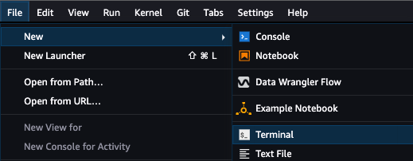
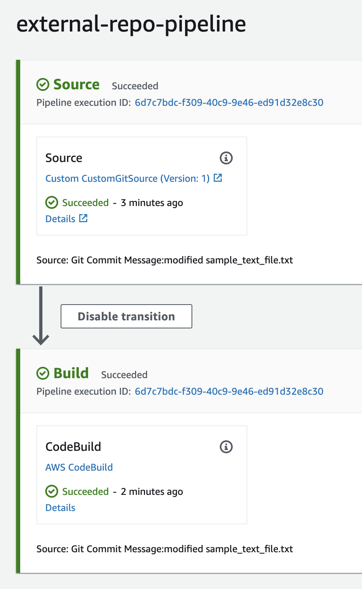

# Testing and Validation
---
## Configure Webhook
Once you complete the [Deployment Guide](documentation/deployment-guide.md) for securely accessing external package repositories, configure the webhook between your internal Git repository and CodePipeline using the _CodePipelineWebHookUrl_ output you retrieved from the final deployment step:

1. Navigate to your internal Git repository.
2. Select **Settings**.
3. Select **Webhooks** then **Add webhook**.
4. Enter your _CodePipelineWebHookUrl_ output in the **Payload URL** field, select _application/json_ under **Content type**, then select **Add webhook**.

<p align="center">
  
</p>

## Deploy and Launch SageMaker Studio
This section provides an overview of how to use SageMaker Studio's system terminal to pull, edit, and push file copies between local and remote repositories. You can alternatively execute your git commands from your local system terminal or other notebook environment.

You can deploy Amazon SageMaker Studio into a controlled environment with multi-layer security and MLOps pipelines by following the instructions in the [Amazon SageMaker Secure MLOps Guide](https://github.com/aws-samples/amazon-sagemaker-secure-mlops).

Once Studio is deployed, navigate to the [SageMaker console](https://console.aws.amazon.com/sagemaker/home?#/dashboard), select **Studio** from the menu on the left, select your **user profile** from the dropdown, then select **Open Studio**. This will launch your Jupyter Lab environment.

<p align="center">
  
</p>

## Clone External Package Repository
Once your webhook is configured, data scientist operating in SageMaker Studio can pull the current version of the public repository request CSV file from the private GitHub repository, append desired additional public repositories to the request record, then push the updated request file back to the private repository.

In the SageMaker Studio IDE, open your system terminal:

<p align="center">
  
</p>

Run the following commands in the terminal to clone your private repository then update and push your public repository request CSV file:

```sh
git init
git config --global user.email "email@example.com"
git config --global user.name "username"
git remote add origin <https://github.com/<username>/<repo>.git)>
git clone <https://github.com/<username>/<repo>.git)> <local-repo>
cd <local-repo>
git checkout <branch>
vi <public-repo-request-file.csv>
git add <public-repo-request-file.csv>
git commit -m "modified <public-repo-request-file.csv>"
git push -u
```
❗ You will need to use a [personal access token](https://docs.github.com/en/authentication/keeping-your-account-and-data-secure/creating-a-personal-access-token) when prompted for your password following the _git push -u_ command.

CodePipeline is configured with custom source action that triggers based on the data scientist's commit to the webhook-enabled Git source repo. CodePipeline execution then orchestrates the CodeBuild project to clone the remote package repository so that an additional CodeBuild project can be used to perform security scans on the cloned repository artifact. You can view CodePipeline's execution status from the [CodePipeline console](https://docs.aws.amazon.com/codepipeline/latest/userguide/pipelines-view-console.html#pipelines-executions-status-console):

<p align="center">
  
</p>

## Perform Security Scans
❗ The security scanning software is not included in the Deployment Guide's CloudFormation deployment and testing validation because of required software licensing. Up to this point, the solution performs the initial external repository ingest, against which you can perform subsequent security scans.

In this case, the solution is expanded using a CodePipeline security test stage that receives the output artifact from our CodeBuild build stage. The security stage includes two actions for both the static analysis (Java API wrapper) and software composition analysis (agent-based) build projects:


<p align="center">
  
</p>

