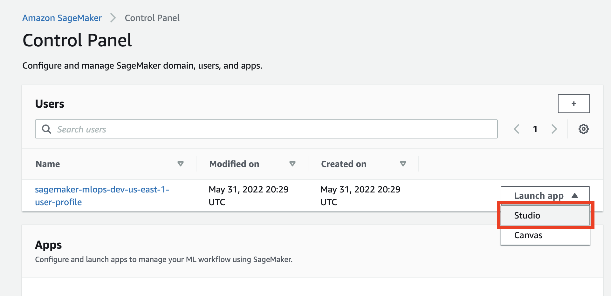

# Testing and Validation
---
Once you complete the [Deployment Guide](documentation/deployment-guide.md) for securely accessing external package repositories, configure the webhook between your internal Git repository and CodePipeline using the _CodePipelineWebHookUrl_ output you retrieved from the final deployment step:

1. Navigate to your internal Git repository.
2. Select **Settings**.
3. Select **Webhooks** then **Add webhook**.
4. Enter your _CodePipelineWebHookUrl_ output in the **Payload URL** field then select **Add webhook**.


### (Optional) Deploy and Launch SageMaker Studio
To launch Studio, navigate to the [SageMaker console](https://console.aws.amazon.com/sagemaker/home?#/dashboard), select **Studio** from the menu on the left, then select **Studio** from the **Launch app** dropdown on the **Users** panel:



### Clone code repository
To use the provided notebooks you must clone the source code repository into your Studio environment.
Open a system terminal in Studio in the **Launcher** window:


Run the following command in the terminal:
```sh
git clone https://github.com/aws-samples/amazon-sagemaker-secure-mlops.git
```

This command downloads and saves the code repository in your home directory in Studio.
Now go to the file browser and open [`00-setup` notebook](../sm-notebooks/00-setup.ipynb):


The first start of the notebook kernel on a new KernelGateway app takes about 5 minutes. Continue with the setup instructions in the notebook after Kernel is ready.

❗ You have to run the whole notebook to setup your SageMaker environment.

Now you setup your data science environment and can start experimenting.

Once your webhook is configured, data scientist can pull the current version of the public repository request CSV file from the private GitHub repository, append desired additional public repositories to the request record, then push the updated request file back to the private repository. This will trigger the CodePipeline execution that clones the remote repositry for security scanning and validation.

```sh
git clone https://github.com/aws-samples/amazon-sagemaker-secure-mlops.git
```

You can deploy Amazon SageMaker Studio into a controlled environment with multi-layer security and MLOps pipelines by following the instructions in the [Amazon SageMaker Secure MLOps Guide](https://github.com/aws-samples/amazon-sagemaker-secure-mlops).

