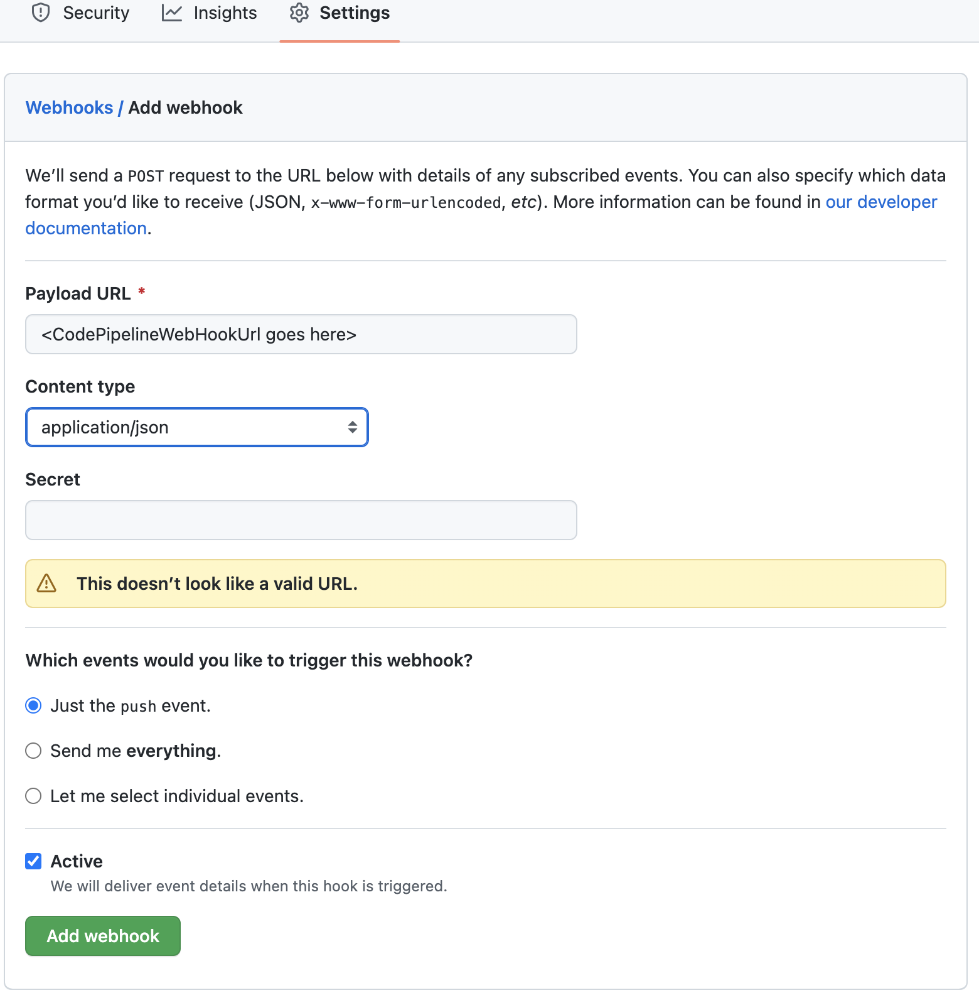
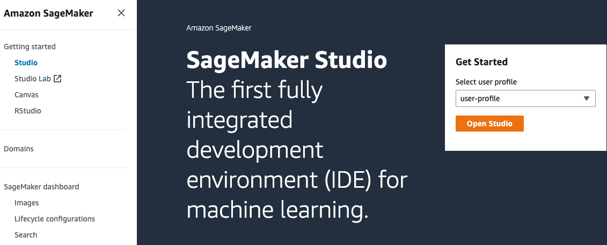

# Testing and Validation
---
## Configure Webhook
Once you complete the [Deployment Guide](documentation/deployment-guide.md) for securely accessing external package repositories, configure the webhook between your internal Git repository and CodePipeline using the _CodePipelineWebHookUrl_ output you retrieved from the final deployment step:

1. Navigate to your internal Git repository.
2. Select **Settings**.
3. Select **Webhooks** then **Add webhook**.
4. Enter your _CodePipelineWebHookUrl_ output in the **Payload URL** field then select **Add webhook**.



## Deploy and Launch SageMaker Studio
This section provides an overview of how to use SageMaker Studio's system terminal to pull, edit, and push file copies between local and remote repositories. You can alternatively execute your git commands from your local system terminal or other notebook environment.

You can deploy Amazon SageMaker Studio into a controlled environment with multi-layer security and MLOps pipelines by following the instructions in the [Amazon SageMaker Secure MLOps Guide](https://github.com/aws-samples/amazon-sagemaker-secure-mlops).

Once Studio is deployed, navigate to the [SageMaker console](https://console.aws.amazon.com/sagemaker/home?#/dashboard), select **Studio** from the menu on the left, select your **user profile** from the dropdown, then select **Open Studio**. This will launch your Jupyter Lab environment.



## Clone code repository
Once your webhook is configured, data scientist operating in SageMaker Studio can pull the current version of the public repository request CSV file from the private GitHub repository, append desired additional public repositories to the request record, then push the updated request file back to the private repository. This will trigger the CodePipeline execution that clones the remote repositry for security scanning and validation.

```sh
git init
git config --global user.email "email@example.com"
git config --global user.name "username"
git remote add origin <https://github.com/<username>/<repo>.git)>
git clone <https://github.com/<username>/<repo>.git)> <local-repo>
cd <local-repo>
git checkout <branch>
vi <public-repo-request-file.csv>
git add <public-repo-request-file.csv>
git commit -m "modified <public-repo-request-file.csv>"
git push -u
```

❗ You will need to use a [personal access token](https://docs.github.com/en/authentication/keeping-your-account-and-data-secure/creating-a-personal-access-token) when prompted for your password following the _git push -u_ command.

To use the provided notebooks you must clone the source code repository into your Studio environment.
Open a system terminal in Studio in the **Launcher** window:


Run the following command in the terminal:
```sh
git clone https://github.com/aws-samples/amazon-sagemaker-secure-mlops.git
```

This command downloads and saves the code repository in your home directory in Studio.
Now go to the file browser and open [`00-setup` notebook](../sm-notebooks/00-setup.ipynb):


The first start of the notebook kernel on a new KernelGateway app takes about 5 minutes. Continue with the setup instructions in the notebook after Kernel is ready.


Now you setup your data science environment and can start experimenting.

❗ The security scanning software is not included in the below AWS CloudFormation deployment and testing validation because of required software licensing. The below solution will perform the initial external repository ingest, against which you could perform subsequent security scans.


